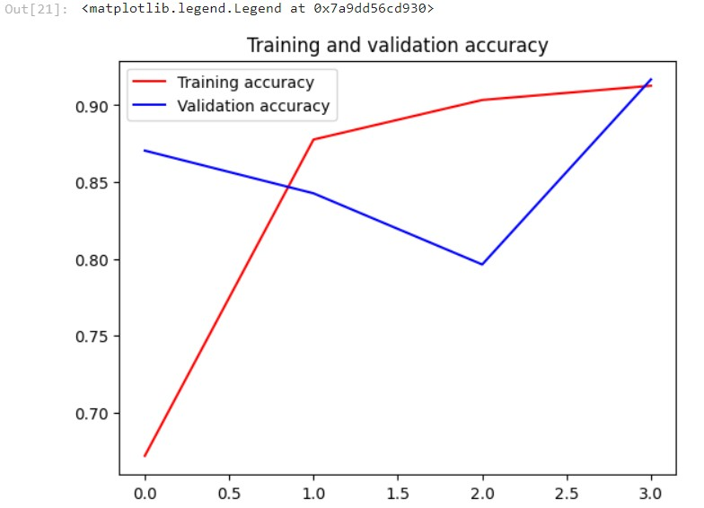
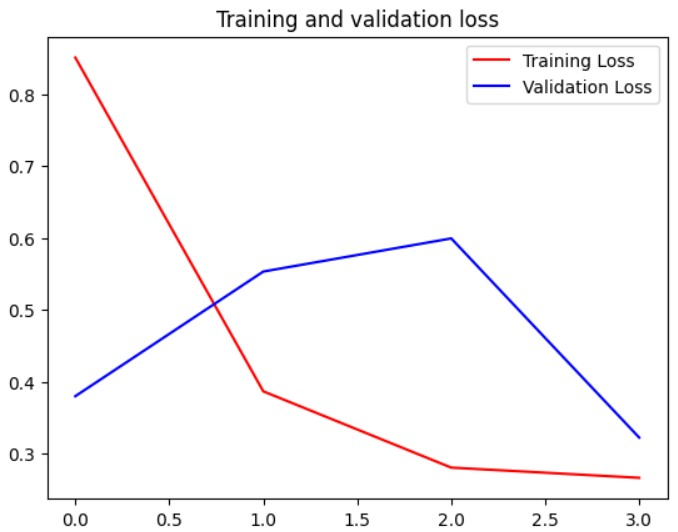
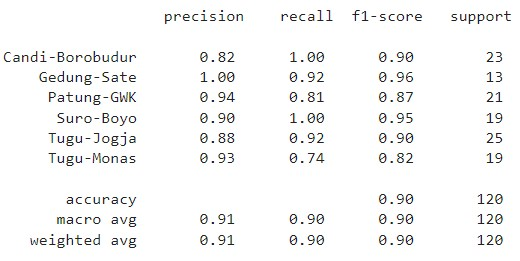
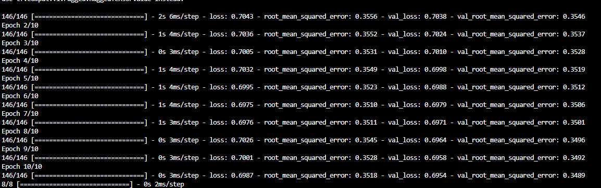
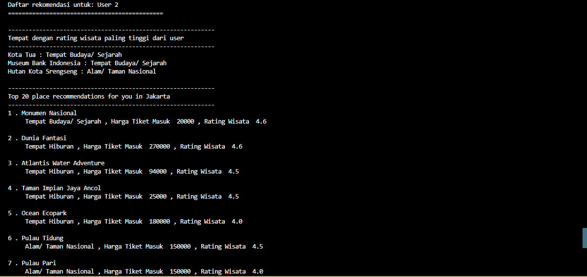

# ML Repository - Destinology (Team CH2-PS397)

**Member of the Machine Learning Team:**
| Member | Student ID | University |
|:------:|:----------:|:----------:|
| Muhammad Fakhriza Fauzan Didaputra | M011BSY1707 | Universitas Padjadjaran|
| Muhammad Radiga Gubarda | M011BSY0712 | Universitas Padjadjaran |
| Hubert Nathanael Christidyawan | M002BSY0362 | Bandung Institute of Technology |

## Tourism, Cultural, and Hospitality - Landmark Recognition
### Overview
This repository contains the code for a landmark recognition project focusing on landmarks in Indonesia. The project utilizes TensorFlow and Convolutional Neural Networks (CNN) to achieve accurate landmark recognition.

### Dataset
The dataset includes a diverse collection of images featuring various landmarks in Indonesia. Preprocessing steps are included to ensure optimal model training.
Our dataset comprises a total of **1.749** images distributed across 6 classes, with the following specifications.
| Class | Amount of Images |
|:------:|:----------:|
| Candi-Borobudur | 249 Images |
| Gedung-Sate | 200 Images |
| Patung-GWK | 357 Images |
| Suro-Boyo | 202 Images |
| Tugu-Jogja | 325 Images |
| Tugu-Monas | 416 Images |

### Architecture
The primary model employs transfer learning from MobileNetV2, incorporating additional custom layers. The input involves images resized to 224 x 224 x 3, and the model is constructed by combining MobileNetV2 (16 residual bottleneck layers) with three newly added dense layers. Subsequently, the model is compiled using the RMSprop optimizer with a learning rate of 0.0005. The ultimate output is the classification of Indonesian Landmarks into 6 distinct classes.

### Performance
#### Accuracy


#### Loss


#### Classification Report


### Run The Model
Requirement to install: tensorflow, sklearn, pandas, seaborn, and matplotlib.
1. Clone the repository:
```
git clone https://github.com/mvrsa/Machine-Learning-for-Landmark-Recognition.git
```
2. Installation:
```
pip install [the packcage]
```
3. Open the **"Transfer Learning.ipynb"** and execute all cells sequentially from top to bottom.
The process involves:
   - Importing necessary libraries such as NumPy, Pandas, Matplotlib.pyplot, and TensorFlow.
   - Creating a DataFrame based on the dataset.
   - Splitting the data into training, validation, and test sets.
   - Establishing an ImageDataGenerator for data augmentation.
   - Loading the pre-trained MobileNetV2 model.
   - Extending MobileNetV2 with additional custom layers.
   - Compiling and training the model.
   - Displaying the model's performance results.
   - Saving the trained model as "Landmark-R.h5" in the "Model" folder.
4. The model saved as **Landmark-R.h5**


## Tourism, Cultural, and Hospitality - Itinerary Recommendation

### Overview
This repository contains the code for a Itinerary Recommendation project focusing on tourist attractions in Indonesia. The project uses a collaborative filtering model which produces tourist destination recommendations that match traveler preferences.

### Dataset
This project uses a dataset from kaggle in providing itinerary recommendations. the dataset consists of three cities such as Jakarta, Surabaya, Yogyakarta. in this project the dataset used consists of 3 files:

tourism_ with _id.csv
user.csv
tourism_rating.csv

SC Dataset: https://www.kaggle.com/datasets/aprabowo/indonesia-tourism-destination

### Architecture
Machine learning model in this project by creating a recommendernet class which performs the process of embedding the user and the next place using sigmoid activation. the model is compiled with binary crossentropy, Adam as an optimizer, and metric evaluation using root mean squared. After that the user will input the city and price range later the encoding results will provide the results of tourist attractions recommendations based on user preferences. 

### Performance






### Run The Model
Requirement to install: tensorflow, sklearn, pandas, seaborn, and matplotlib.
1. Clone the repository:
```
git clone https://github.com/diga-tech/Destinology_ML
```
2. Installation:
```
pip install [the packcage]
```
3. Open the **Itinerary-Planner/using_model.py"** and execute all cells sequentially from top to bottom.
The process involves:
   - Importing necessary libraries such as NumPy, Pandas,  and TensorFlow.
   - Creating a DataFrame based on the dataset.
   - Creating Encoding label user and place for identifier 
   - Mapping the label place and user to rating dataframe
   - Splitting the data into training and validation.
   - Creating Recommendernet Class
   - Compiling and training the model.
   - Saving the trained model
   - Provide itinerary recommendations based on user preferences

   Ref: 
   https://github.com/Maoelan/indonesia-tourism-destination-recommendation/tree/main
   https://github.com/rafka-imandaputra/Bandung-tourist-destination-recommendation-system/tree/main
   https://www.kaggle.com/datasets/aprabowo/indonesia-tourism-destination/code